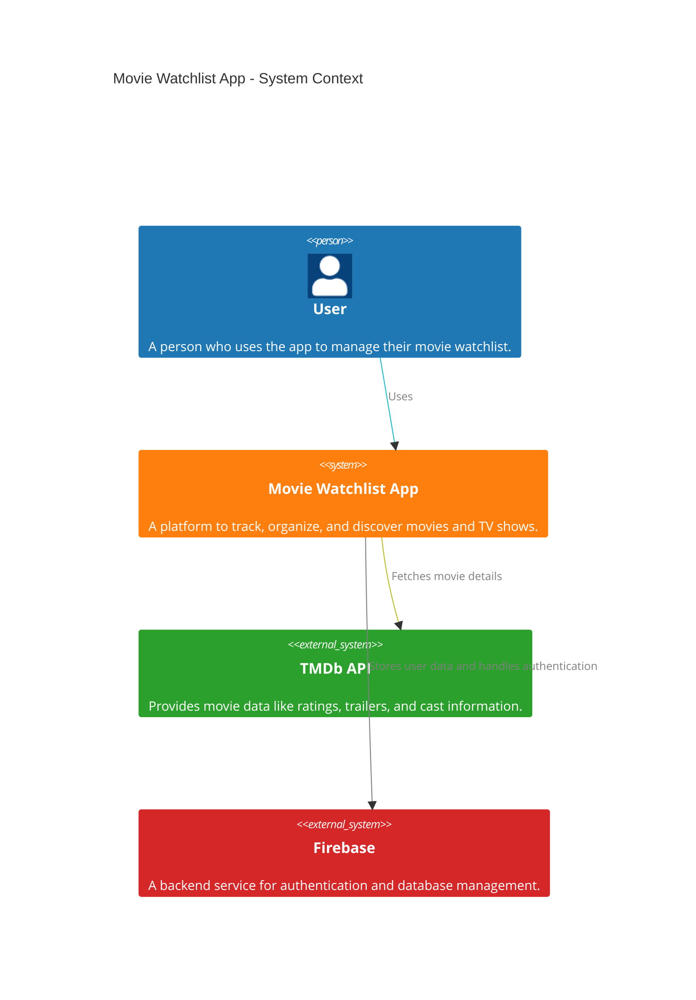
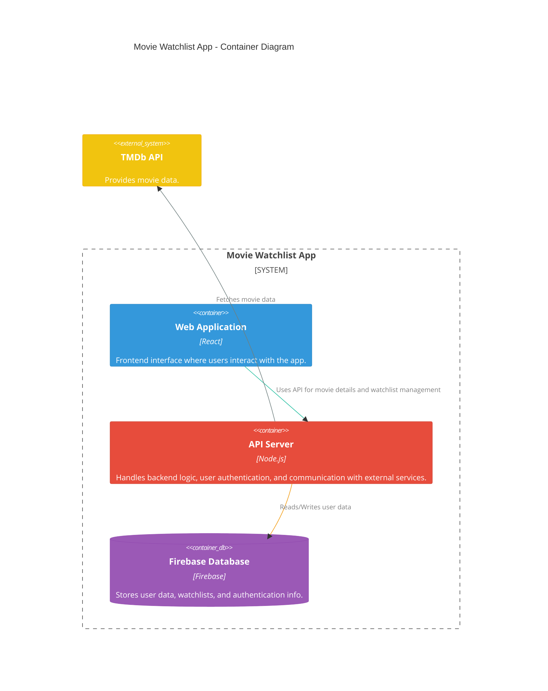
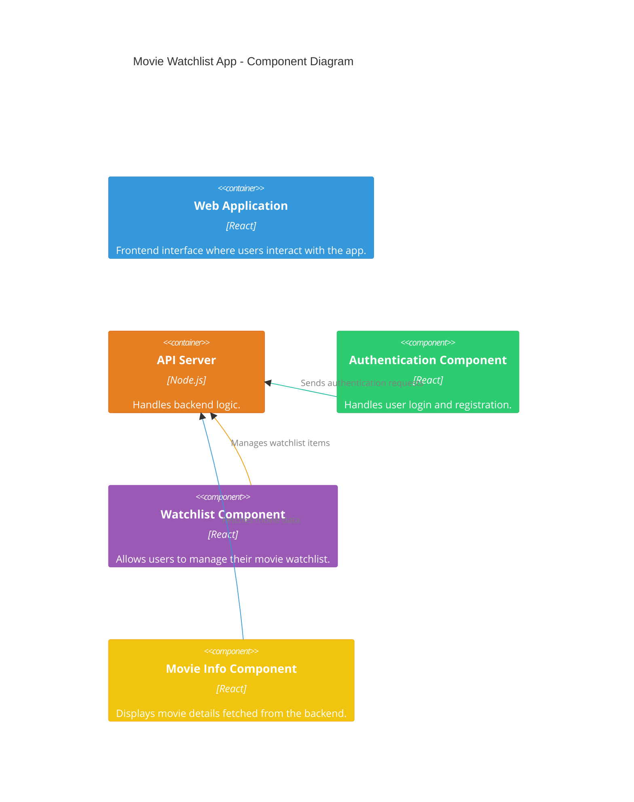

<h1>Movie Watchlist</h1>

<h2>Description</h2>
<p>The Movie Watchlist app is a web-based application that helps users manage and track movies they want to watch. Users can add movies to a personalized watchlist, mark them as watched, and categorize them by genre or priority. The app will also feature user authentication, real-time updates, and optional movie recommendations.</p>


<h2>C4 Context Diagram:</h2>



<h2>C4 Container Diagram:</h2> 



<h2>C4 Component Diagram: </h2>



<h2>C4 Deployment Diagram:</h2>

```mermaid

C4Deployment
    title Movie Watchlist App - Deployment Diagram
    
    Node(webServer, "Web Server", "Hosts the React application") {
        Container(webApp, "Web Application", "React", "Frontend interface where users interact with the app.")
    }
    
    Node(appServer, "App Server", "Node.js Backend Server") {
        Container(api, "API Server", "Node.js", "Handles backend logic and communicates with Firebase and TMDb API.")
    }

    Node(firebaseCloud, "Firebase Cloud", "Firebase") {
        Container(database, "Firebase Database", "Firebase", "Stores user data and watchlists.")
    }

    Node(tmdbCloud, "TMDb Cloud", "TMDb API") {
        Container(tmdbAPI, "TMDb API", "TMDb", "Provides movie data including ratings, cast, and trailers.")
    }

    Rel(webApp, api, "Uses API for movie data and watchlist management")
    Rel(api, database, "Reads/Writes data to Firebase")
    Rel(api, tmdbAPI, "Fetches movie data from TMDb")
