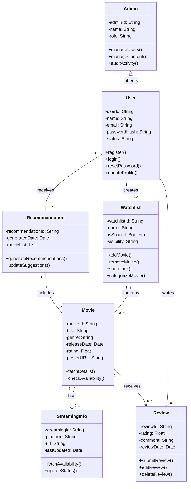

# 🎯 Domain Model – Movie Watchlist App

## 📘 Domain Entities Overview

| **Entity**         | **Attributes**                                                                 | **Methods (Responsibilities)**                                | **Relationships**                                      |
|--------------------|--------------------------------------------------------------------------------|----------------------------------------------------------------|---------------------------------------------------------|
| **User**           | userId, name, email, passwordHash, status                                      | register(), login(), resetPassword(), updateProfile()          | Creates Watchlists, Marks Movies as Watched            |
| **Movie**          | movieId, title, genre, releaseDate, rating, posterURL                          | fetchDetails(), checkAvailability()                            | Added to Watchlists, Linked to Recommendations         |
| **Watchlist**      | watchlistId, name, isShared, visibility, ownerId                               | addMovie(), removeMovie(), shareLink(), categorizeMovie()      | Belongs to User, Contains Movies                       |
| **Recommendation** | recommendationId, userId, generatedDate, movieList                             | generateRecommendations(), updateSuggestions()                 | Linked to User, Contains Movies                        |
| **StreamingInfo**  | streamingId, movieId, platform, url, lastUpdated                               | fetchAvailability(), updateStatus()                            | One-to-One with Movie                                  |
| **Review**         | reviewId, userId, movieId, rating, comment, reviewDate                         | submitReview(), editReview(), deleteReview()                   | One-to-One with Movie, One-to-Many from User           |
| **Admin**          | adminId, name, role                                                            | manageUsers(), manageContent(), auditActivity()                | Can access Users and Movies                            |

---

## 🧠 Business Rules

- A **user** must verify their email to activate their account.
- A **watchlist** can be shared if marked as `isShared = true`, and must have a unique `shareLink`.
- A **user** cannot add the same movie to the same watchlist more than once.
- A **movie** can be marked as "Watched" only once per user.
- **Recommendations** require generating a minimum of 3 watched movies.
- **Streaming info** must be updated at least once every 24 hours.
- Only **Admins** can delete users or movies from the database.
- A **user** can only submit one **review** per movie.

---

# Class Diagram In Mermaid

