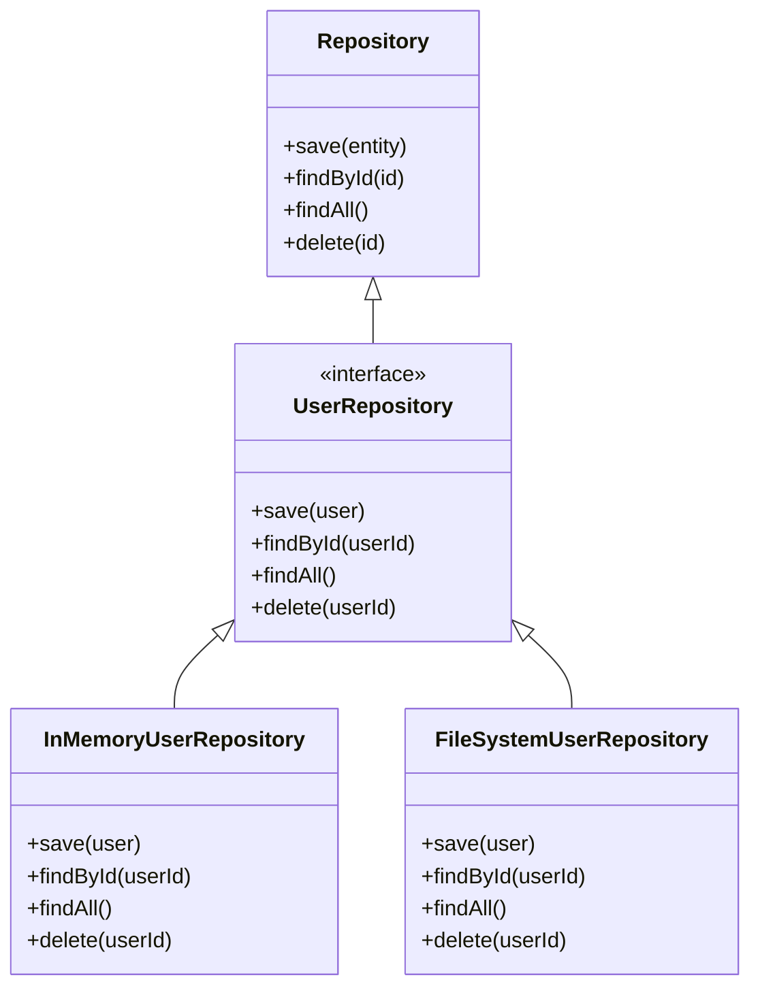

# Updated Class Diagram

```mermaid

classDiagram
class Repository {
  +save(entity)
  +findById(id)
  +findAll()
  +delete(id)
}

class UserRepository {
  <<interface>>
  +save(user)
  +findById(userId)
  +findAll()
  +delete(userId)
}

class InMemoryUserRepository {
  +save(user)
  +findById(userId)
  +findAll()
  +delete(userId)
}

class FileSystemUserRepository {
  +save(user)
  +findById(userId)
  +findAll()
  +delete(userId)
}

Repository <|-- UserRepository
UserRepository <|-- InMemoryUserRepository
UserRepository <|-- FileSystemUserRepository


```
