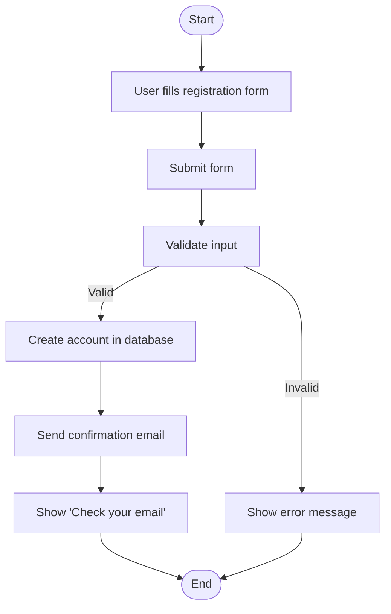
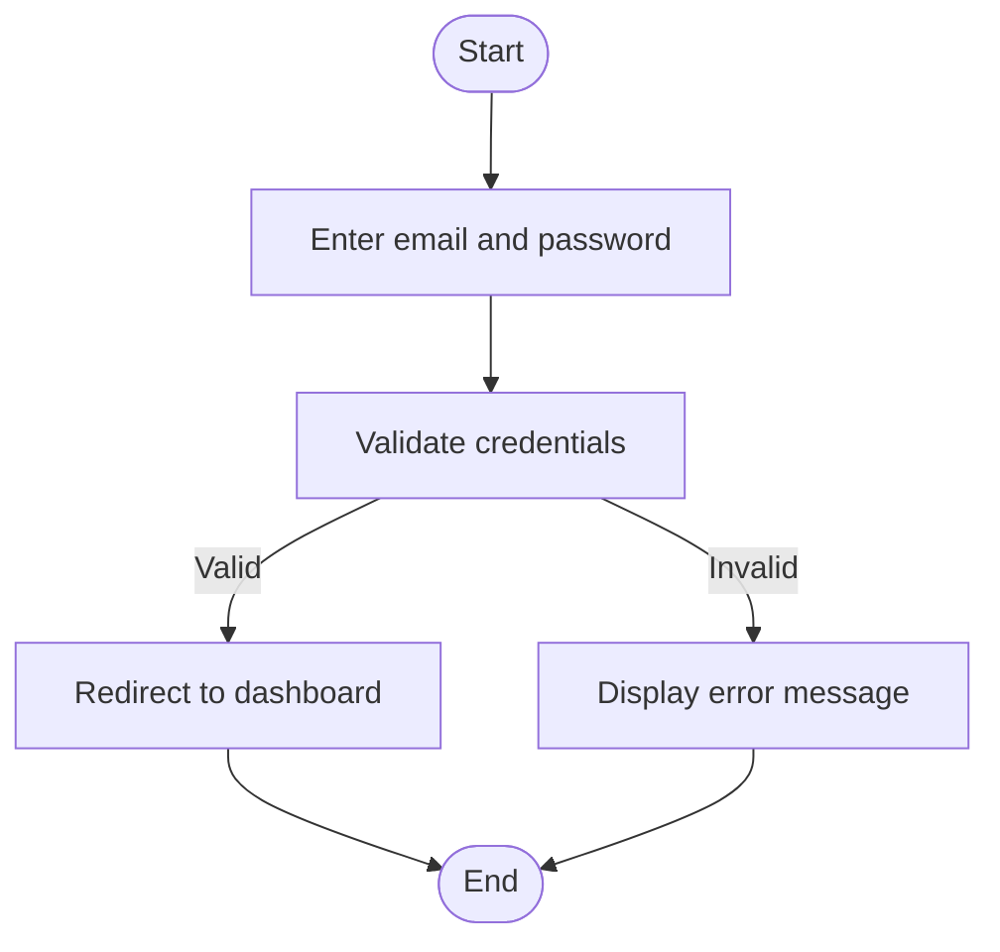
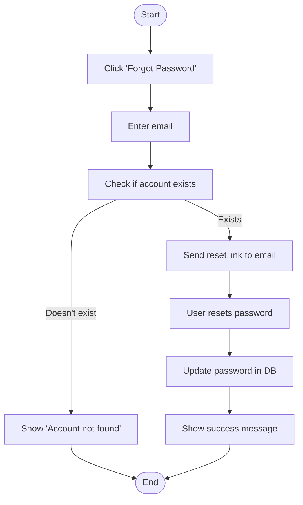
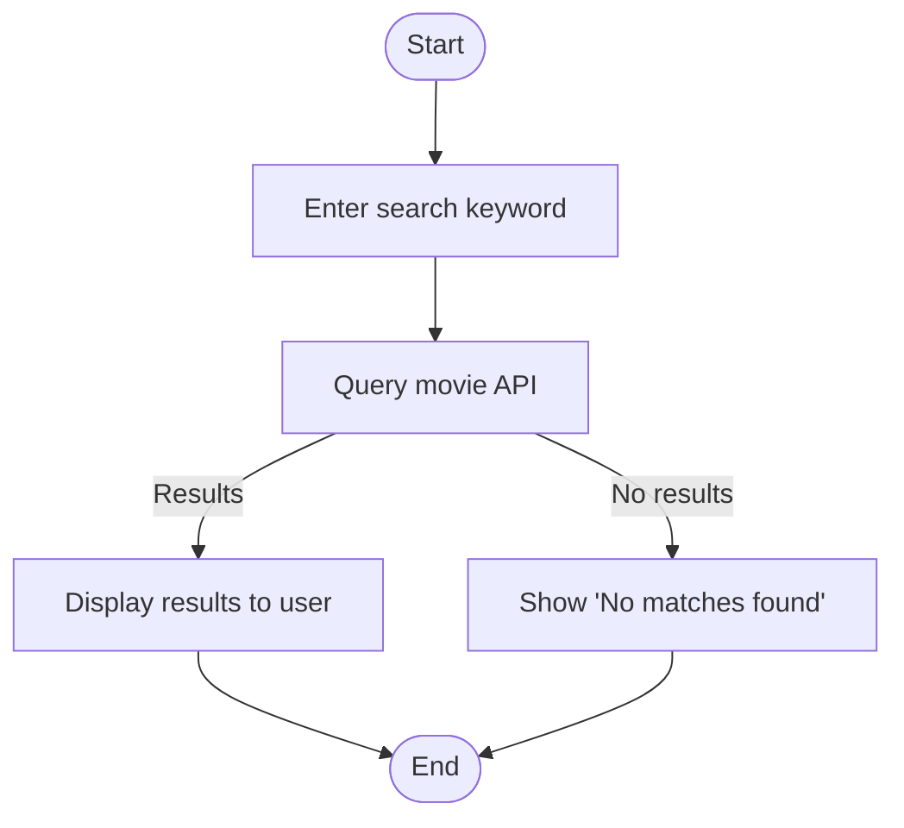
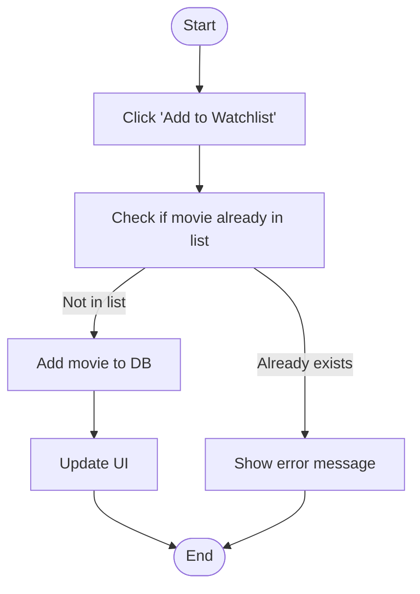
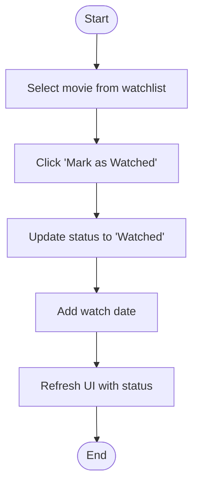
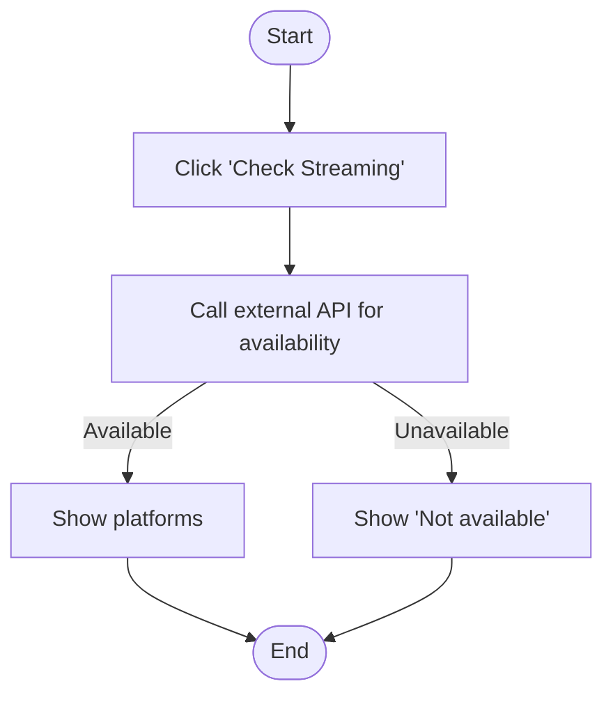
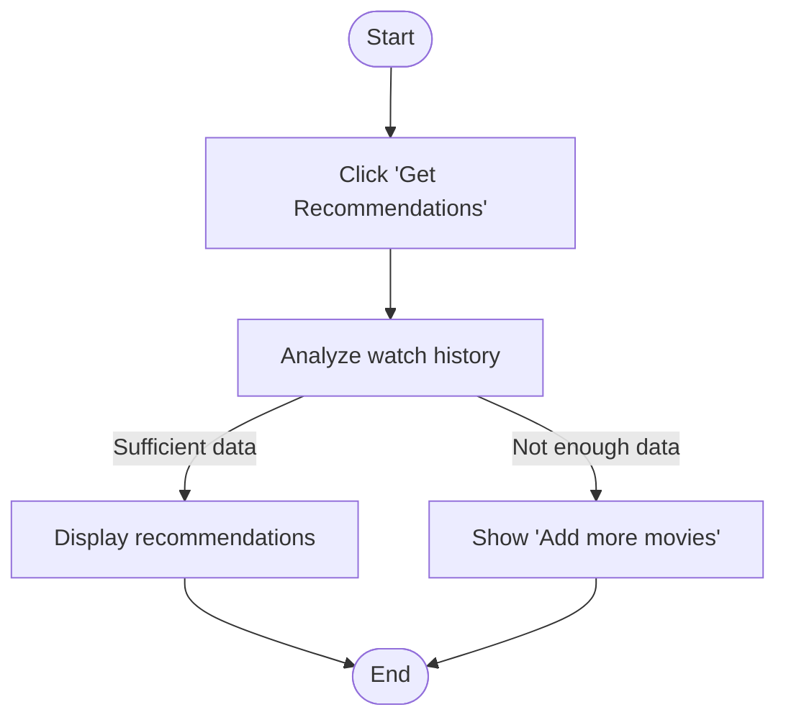

## 🎯 Activity Diagrams for Movie Watchlist App Workflows

### 1. **User Registration**

**Explanation**: This diagram represents the user registration workflow. The user fills and submits the form. The system validates the input and, if valid, creates the account and sends a confirmation email. If invalid, an error message is shown. This maps to **FR-001 (User Authentication)**.

---

### 2. **User Login**

**Explanation**: This diagram shows the login process. Upon entering credentials, the system checks them. If correct, the user is logged in; otherwise, an error is shown. Linked to **FR-001** and **FR-012**.

---

### 3. **Password Reset**

**Explanation**: This covers the password recovery flow, verifying if the email exists and allowing the user to reset their password. Tied to **FR-001** and **FR-012**.

---

### 4. **Search Movies**

**Explanation**: This illustrates the movie search functionality. Based on the input, results are shown or a no match message is returned. Maps to **FR-004 (Search & Discovery)**.

---

### 5. **Add Movie to Watchlist**

**Explanation**: This shows the user adding a movie to their watchlist. The system checks for duplicates before updating. Matches **FR-002 (Watchlists)**.

---

### 6. **Mark Movie as Watched**

**Explanation**: This diagram marks a movie as watched and updates the watch date. Supports **FR-007 (Mark Movies as Watched)**.

---

### 7. **Check Streaming Availability**

**Explanation**: This activity checks where a movie is available for streaming using an external API. Supports **FR-006 (Streaming Platform Availability)**.

---

### 8. **Generate Movie Recommendations**

**Explanation**: This models how the system generates personalized movie recommendations. Depends on user history and supports **FR-008 (Recommendations)**.

---
