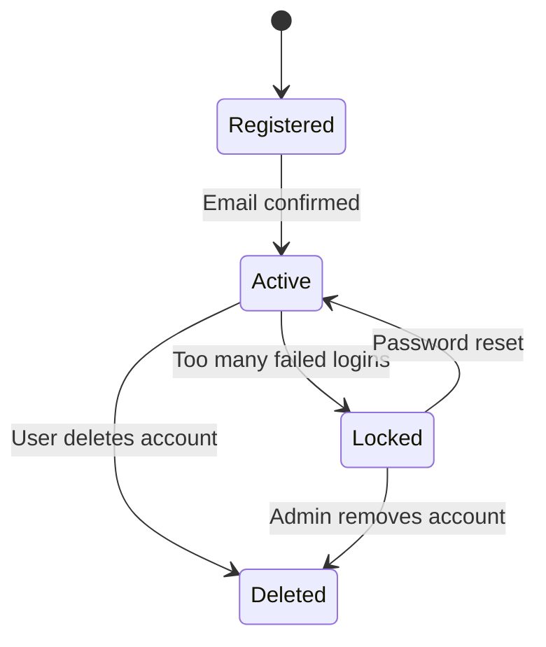
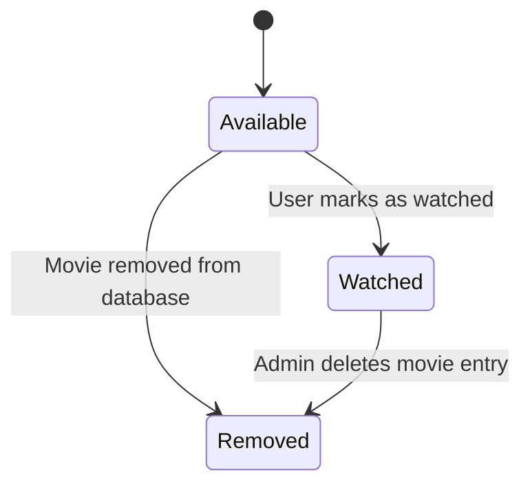
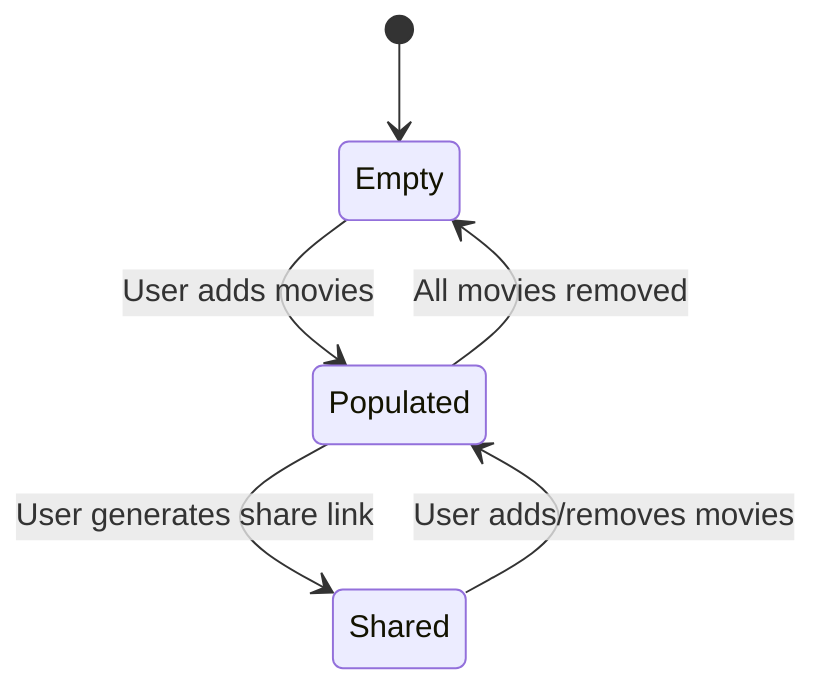

# 🎬 1. User Account

---

# 🔍 Explanation
Registered: After sign-up but before email confirmation.

Active: Fully functional user account.

Locked: Triggered by multiple failed login attempts.

Deleted: Account removal.

Maps to:

FR-001 (User Authentication)

FR-012 (Error Handling & Notifications)

---

# 🎥 2. Movie

# 🔍 Explanation
Available: Movie can be added to watchlist.

Watched: User has completed viewing.

Removed: Deleted from system.

Maps to:

FR-007 (Mark Movies as Watched)

FR-003 (Personalized Watchlists)

