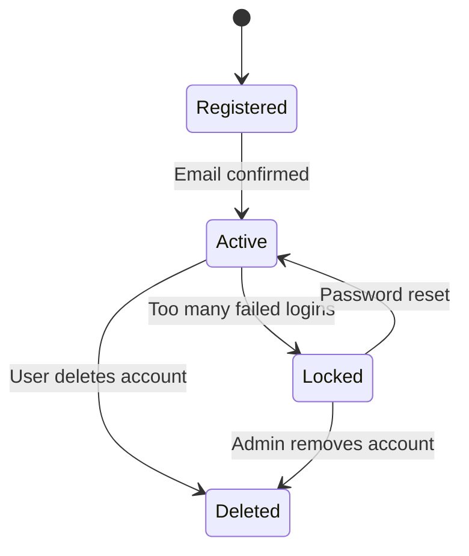
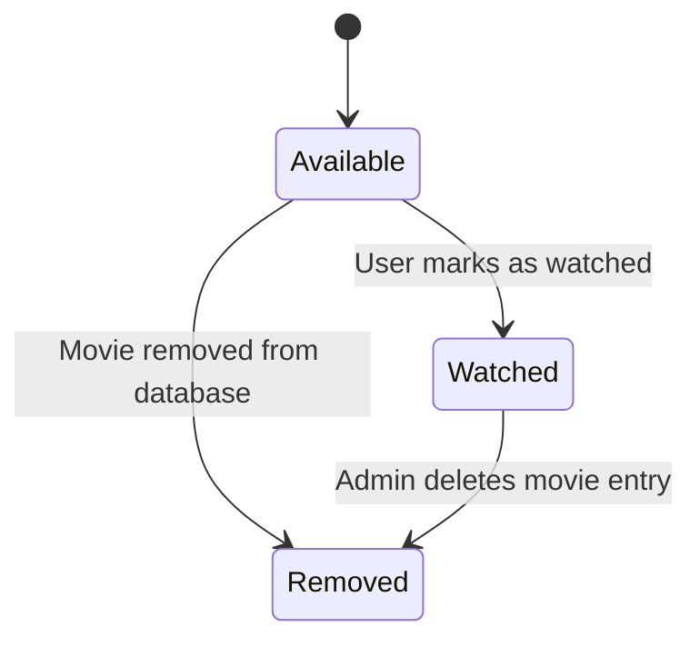
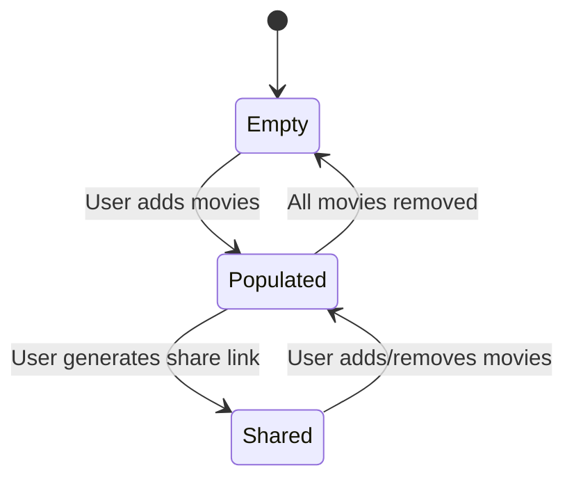
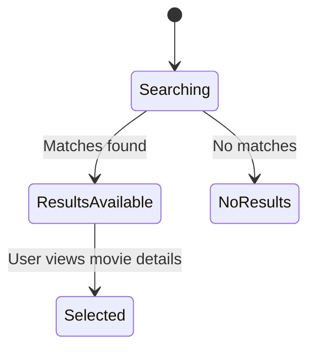
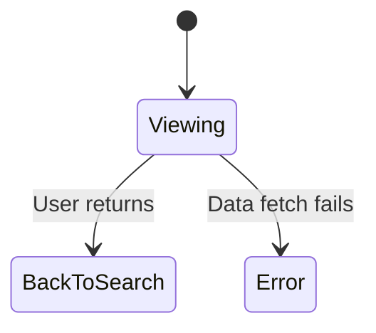
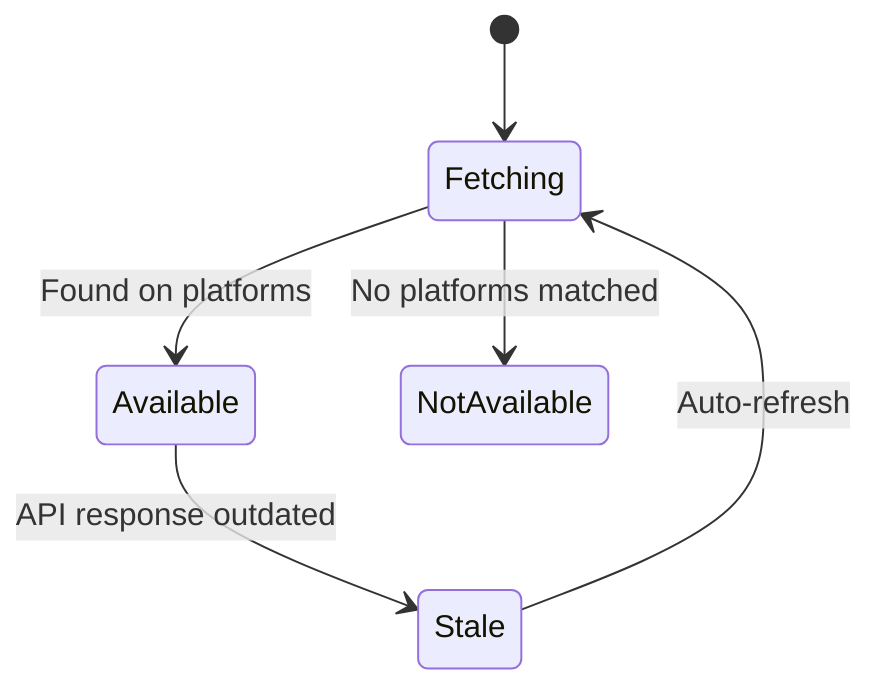
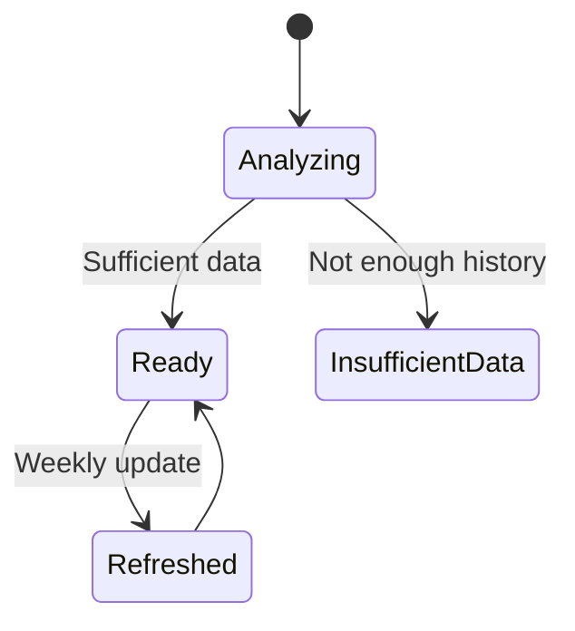

# 🎬 1. User Account

---

# 🔍 Explanation
Registered: After sign-up but before email confirmation.

Active: Fully functional user account.

Locked: Triggered by multiple failed login attempts.

Deleted: Account removal.

Maps to:

FR-001 (User Authentication)

FR-012 (Error Handling & Notifications)

---

# 🎥 2. Movie

# 🔍 Explanation
Available: Movie can be added to watchlist.

Watched: User has completed viewing.

Removed: Deleted from system.

Maps to:

FR-007 (Mark Movies as Watched)

FR-003 (Personalized Watchlists)

---

# 📄 3. Watchlist

#🔍 Explanation
Empty: No movies added yet.

Populated: Contains one or more movies.

Shared: Watchlist is publicly viewable via a link.

Maps to:

FR-002 (Personalized Watchlists)

FR-005 (Watchlist Sharing)

---

# 🔎 4. Search Request

# 🔍 Explanation
Searching: System processes the query.

ResultsAvailable: Movies matched.

NoResults: Query returned no items.

Selected: User clicked on a movie.

Maps to:

FR-004 (Search & Discovery)

FR-010 (Responsive Interface)

---

# 🎞️ 5. Movie Details View

# 🔍 Explanation
Viewing: User is on the movie detail page.

BackToSearch: Navigates back to search.

Error: Failed to load data.

Maps to:

FR-004 (Movie Details Page)

FR-012 (Error Handling & Notifications)

---

# 📡 6. Streaming Availability Check

# 🔍 Explanation
Fetching: System checks external API.

Available: Movie is on a streaming service.

NotAvailable: None found.

Stale: Outdated data (triggered for daily update).

Maps to:

FR-006 (Streaming Availability)

FR-011 (Real-Time Updates)

---

# 🤖 7. Recommendation Engine

# 🔍 Explanation
Analyzing: Engine evaluates user's watch history.

Ready: Recommendations generated.

InsufficientData: Too little data to analyze.

Refreshed: Weekly refresh cycle.

Maps to:

FR-008 (Personalized Recommendations)

FR-011 (Real-Time Updates)
