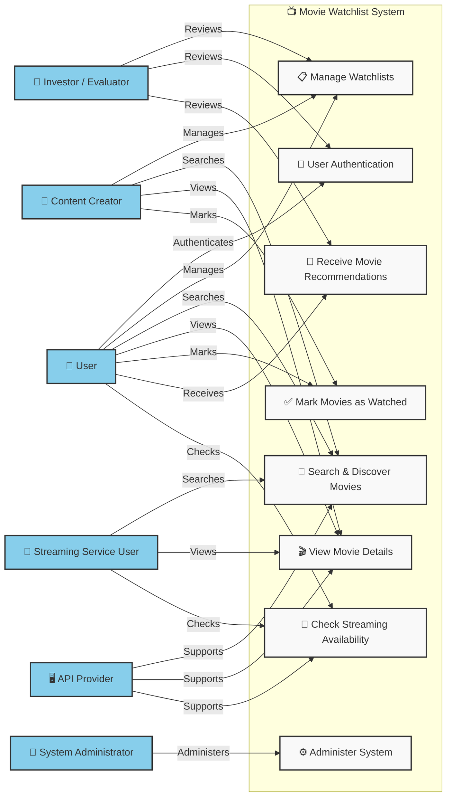

<h1>1️⃣ Use Case Diagram</h1>

<h1>Actors and Their Roles</h1>

- The User actor can initiate the User Authentication use case, allowing them to sign up, log in, and log out. This ensures a secure and personalized experience while addressing the Investor/Project Evaluator’s concern about user engagement and security.

- The User actor can initiate the Manage Watchlists use case, which allows them to create, update, delete, and share their watchlists. This supports the Investor/Project Evaluator’s concern about tracking user engagement and retention.

- The User actor can initiate the Search & Discover Movies use case, enabling them to find movies by title, genre, release year, or rating. This use case is supported by the API Provider, ensuring real-time access to an extensive movie database.

- The User actor can initiate the View Movie Details use case, accessing trailers, cast information, synopses, and ratings. This use case is also supported by the API Provider, ensuring accurate and up-to-date information.

- The User actor can initiate the Mark Movies as Watched use case, allowing them to track their progress. This feature supports user engagement metrics that investors may review.

- The User actor can initiate the Receive Movie Recommendations use case, generating personalized suggestions based on their preferences. This supports the Investor/Project Evaluator’s concern about user engagement and retention through AI-driven recommendations.

- The User actor can initiate the Check Streaming Availability use case, which helps them find out where a movie is available for streaming. This is supported by the API Provider, ensuring up-to-date availability information for various streaming services.

- The Content Creator actor can initiate the Manage Watchlists, Search & Discover Movies, View Movie Details, and Mark Movies as Watched use cases, allowing them to organize and review movies for their audience. This supports content creation and engagement, which is crucial for platform growth.

- The Streaming Service User actor can initiate the Search & Discover Movies, View Movie Details, and Check Streaming Availability use cases, helping them find content and track availability across platforms.

- The System Administrator actor can initiate the Administer System use case, maintaining system performance, handling API requests, and ensuring security. This addresses concerns about system reliability and data integrity.

- The API Provider actor supports the Search & Discover Movies, View Movie Details, and Check Streaming Availability use cases, ensuring users have access to real-time, accurate movie information.

- The Investor/Project Evaluator actor reviews the Manage Watchlists, User Authentication, and Receive Movie Recommendations use cases, assessing the platform's feasibility, engagement, and user retention potential.

# 2️⃣ Use Case Specifications

## 1. User Authentication
**Actor:** User  
**Precondition:** The user must have an existing account or be ready to register.  
**Postcondition:** The user is logged in and has access to the system.  

### Basic Flow:
1. User navigates to the login page.  
2. User enters username and password.  
3. System validates credentials.  
4. System logs in the user and redirects to the homepage.  

### Alternative Flows:
- If the credentials are invalid, the system displays an error message: "Invalid username or password."  
- If the user forgets their password, they can click "Forgot Password" to reset it.

---

## 2. Manage Watchlists
**Actor:** User  
**Precondition:** The user must be authenticated and logged in.  
**Postcondition:** The user's watchlist is updated with new movies or shows.  

### Basic Flow:
1. User navigates to the watchlist management page.  
2. User selects "Add Movie" or "Remove Movie."  
3. System updates the watchlist accordingly.  
4. System displays the updated watchlist to the user.  

### Alternative Flows:
- If the user tries to add a movie that is already in the watchlist, the system shows an error message: "Movie already in your watchlist."

---

## 3. Search & Discover Movies
**Actor:** User  
**Precondition:** The user must be logged in or browsing anonymously.  
**Postcondition:** A list of movies based on search criteria is displayed.  

### Basic Flow:
1. User enters a search query (e.g., movie name or genre).  
2. System queries the movie database.  
3. System displays a list of matching movies.  
4. User selects a movie from the list for more details.  

### Alternative Flows:
- If no results are found, the system displays a message: "No movies found for your query."

---

## 4. View Movie Details
**Actor:** User  
**Precondition:** The user must have selected a movie from the search results or watchlist.  
**Postcondition:** The user views detailed information about the movie.  

### Basic Flow:
1. User clicks on a movie title.  
2. System retrieves movie details such as genre, cast, director, and description.  
3. System displays movie information on a new page.  

### Alternative Flows:
- If the movie information is unavailable, the system displays a message: "Details not available for this movie."

---

## 5. Mark Movies as Watched
**Actor:** User  
**Precondition:** The user must be logged in and have the movie in their watchlist.  
**Postcondition:** The movie is marked as "Watched" in the user's watchlist.  

### Basic Flow:
1. User navigates to their watchlist.  
2. User selects a movie to mark as watched.  
3. System updates the movie's status to "Watched."  
4. System reflects the change in the user's watchlist.  

### Alternative Flows:
- If the movie is already marked as watched, the system displays a message: "This movie is already marked as watched."

---

## 6. Receive Movie Recommendations
**Actor:** User  
**Precondition:** The user must be logged in and have a sufficient movie history for the system to base recommendations.  
**Postcondition:** The user receives a list of recommended movies based on their preferences.  

### Basic Flow:
1. User selects the "Recommendations" section.  
2. System analyzes the user's viewing history and preferences.  
3. System generates a list of recommended movies.  
4. System displays the recommendations to the user.  

### Alternative Flows:
- If the system cannot generate recommendations due to lack of data, it shows: "No recommendations available at this time."

---

## 7. Check Streaming Availability
**Actor:** User  
**Precondition:** The user must be logged in or browsing a movie's details.  
**Postcondition:** The system displays streaming service availability for the selected movie.  

### Basic Flow:
1. User views the details of a movie.  
2. User selects "Check Streaming Availability."  
3. System queries streaming services to determine where the movie is available.  
4. System displays a list of available streaming platforms.  

### Alternative Flows:
- If the movie is unavailable on any streaming platform, the system displays: "Movie not available on any streaming service."

---

## 8. Administer System
**Actor:** System Administrator  
**Precondition:** The administrator must be logged in with the necessary permissions.  
**Postcondition:** The system is updated, and the administrator's changes are reflected.  

### Basic Flow:
1. The System Administrator logs in to the administration panel.  
2. Administrator selects a management task (e.g., add/remove users, update database).  
3. The system processes the administrator's request.  
4. The system displays confirmation of the completed action.  

### Alternative Flows:
- If the administrator attempts an unauthorized action, the system shows an error message: "You do not have permission to perform this action."

# 3️⃣ Test Case Development

<h2>Functional Requirements Test Cases</h2>

| Test Case ID | Requirement ID | Description                                          | Steps                                                                                  | Expected Result                                            | Actual Result | Status (Pass/Fail) |
|--------------|----------------|------------------------------------------------------|----------------------------------------------------------------------------------------|------------------------------------------------------------|----------------|--------------------|
| TC001        | FR-001         | User switches to Dark Mode                           | 1. Log in to the system. 2. Navigate to settings. 3. Select "Dark Mode."              | System switches to dark mode with proper color scheme.     |                |                    |
| TC002        | FR-002         | User switches to Light Mode                          | 1. Log in to the system. 2. Navigate to settings. 3. Select "Light Mode."             | System switches to light mode with proper color scheme.    |                |                    |
| TC003        | FR-003         | User navigates the system with keyboard navigation   | 1. Log in to the system. 2. Navigate through pages using Tab/Shift+Tab.                | The system should allow smooth navigation using keyboard.   |                |                    |
| TC004        | FR-004         | User adds a movie to the watchlist                   | 1. Log in to the system. 2. Search for a movie. 3. Select a movie and click "Add to Watchlist." | Movie is added to the user's watchlist.                    |                |                    |
| TC005        | FR-005         | System displays movie search results within 2 seconds | 1. Log in to the system. 2. Enter a movie title in the search bar. 3. Click "Search."   | Search results are displayed within 2 seconds.             |                |                    |
| TC006        | FR-006         | User marks a movie as "Watched"                       | 1. Log in to the system. 2. Go to the watchlist. 3. Select a movie and click "Mark as Watched." | Movie is marked as "Watched" in the watchlist.             |                |                    |
| TC007        | FR-007         | User views movie details                             | 1. Log in to the system. 2. Select a movie from the watchlist. 3. Click on the movie title. | Movie details (cast, description, etc.) are displayed.     |                |                    |
| TC008        | FR-008         | System responds to movie data request within 500 milliseconds | 1. Log in to the system. 2. Enter a movie title in the search bar. 3. Click "Search."   | The API responds with movie data in ≤ 500 milliseconds.    |                |                    |

## Non-Functional Test Cases

- Usability Test: Ensures the system allows smooth switching between dark and light mode (important for user experience).
- Performance Test: Simulates 1,000 concurrent users to check if the system's response time for search results stays within the expected 2 seconds.

# 4️⃣Reflection

Translating software requirements into use cases and test cases is a crucial but often challenging process. As I worked through this, I realized that the process is not as straightforward as it initially seemed. Many challenges arise, particularly in interpreting vague requirements, ensuring complete user interactions, and balancing functional and non-functional needs.

One of the biggest challenges I faced was dealing with ambiguity in requirements. Some requirements were too broad or lacked specific details, making it difficult to determine how they should be implemented or tested. For example, a requirement like “The system should provide movie recommendations” leaves a lot of unanswered questions. Should recommendations be based on past watch history, ratings, or something else? Without clear criteria, writing meaningful test cases becomes difficult. To address this, I learned that it’s important to clarify requirements with stakeholders, document assumptions, and refine requirements iteratively.

Another difficulty was identifying all possible ways users might interact with the system. While some interactions are obvious, such as searching for a movie or adding one to a watchlist, others are less predictable. Users might use different devices, input unexpected search terms, or take actions I hadn’t originally considered. For instance, I had to think about whether users should be able to search using special characters or partial movie names. This made me realize the importance of user research and scenario-based testing to cover a broader range of interactions.

Balancing functional and non-functional requirements was another challenge. Functional requirements are usually easier to test since they focus on specific features. However, non-functional requirements, like system performance, usability, or security, are harder to measure. A requirement like “The system should provide a fast search experience” doesn’t define what “fast” means. To solve this, I had to convert vague descriptions into measurable criteria, such as “Search results should load within 2 seconds.” This experience showed me how important it is to define testable benchmarks for non-functional requirements.

Additionally, I found that some requirements were difficult to test directly. For example, a requirement like “The system should be user-friendly” is subjective. What one person finds user-friendly, another might not. To address this, I realized the importance of breaking down such requirements into measurable factors, like how easily users complete tasks or how much time they spend searching for a feature.

Handling alternative and exceptional flows was another area where I faced challenges. While it was easy to define the basic steps of a use case, I also had to consider what happens when things go wrong. What if the API providing movie data is down? What if a user enters an invalid password too many times? These scenarios required extra test cases to make sure the system responds properly to unexpected situations.

Lastly, I encountered the challenge of managing changing requirements. As I developed my use cases and test cases, I realized that some requirements needed to be updated or refined. This showed me why flexibility is crucial in software development. Agile methodologies and iterative testing can help teams adjust as requirements evolve.

Overall, this experience taught me that translating requirements into use cases and test cases is not just a technical task, it requires critical thinking, communication, and adaptability. By addressing these challenges, I gained a better understanding of how to build a system that meets user needs while ensuring reliability and usability.
