<h1>Use Case Diagram</h1>

<h1>Actors and Their Roles</h1>

```mermaid

graph LR;
    %% Define actors
    User["🧑 User"]:::actor
    ContentCreator["🧑 Content Creator"]:::actor
    StreamingServiceUser["🧑 Streaming Service User"]:::actor
    SystemAdministrator["🧑 System Administrator"]:::actor
    APIProvider["🖥️ API Provider"]:::actor
    InvestorProjectEvaluator["💼 Investor / Evaluator"]:::actor

    %% Define system boundary
    subgraph MovieWatchlistSystem["📺 Movie Watchlist System"]
        UserAuthentication["🔑 User Authentication"]:::usecase
        ManageWatchlists["📋 Manage Watchlists"]:::usecase
        SearchDiscoverMovies["🔎 Search & Discover Movies"]:::usecase
        ViewMovieDetails["🎬 View Movie Details"]:::usecase
        MarkMoviesWatched["✅ Mark Movies as Watched"]:::usecase
        ReceiveMovieRecommendations["🤖 Receive Movie Recommendations"]:::usecase
        CheckStreamingAvailability["📡 Check Streaming Availability"]:::usecase
        AdministerSystem["⚙️ Administer System"]:::usecase
    end

    %% Define relationships
    User -->|Authenticates| UserAuthentication
    User -->|Manages| ManageWatchlists
    User -->|Searches| SearchDiscoverMovies
    User -->|Views| ViewMovieDetails
    User -->|Marks| MarkMoviesWatched
    User -->|Receives| ReceiveMovieRecommendations
    User -->|Checks| CheckStreamingAvailability

    ContentCreator -->|Manages| ManageWatchlists
    ContentCreator -->|Searches| SearchDiscoverMovies
    ContentCreator -->|Views| ViewMovieDetails
    ContentCreator -->|Marks| MarkMoviesWatched

    StreamingServiceUser -->|Searches| SearchDiscoverMovies
    StreamingServiceUser -->|Views| ViewMovieDetails
    StreamingServiceUser -->|Checks| CheckStreamingAvailability

    SystemAdministrator -->|Administers| AdministerSystem

    APIProvider -->|Supports| SearchDiscoverMovies
    APIProvider -->|Supports| ViewMovieDetails
    APIProvider -->|Supports| CheckStreamingAvailability

    InvestorProjectEvaluator -->|Reviews| ManageWatchlists
    InvestorProjectEvaluator -->|Reviews| UserAuthentication
    InvestorProjectEvaluator -->|Reviews| ReceiveMovieRecommendations

    %% Styling
    classDef actor fill:#87CEEB,stroke:#333,stroke-width:2px;
    classDef usecase fill:#F9F9F9,stroke:#333,stroke-width:2px;
    
    class User,ContentCreator,StreamingServiceUser,SystemAdministrator,APIProvider,InvestorProjectEvaluator actor;
    class UserAuthentication,ManageWatchlists,SearchDiscoverMovies,ViewMovieDetails,MarkMoviesWatched,ReceiveMovieRecommendations,CheckStreamingAvailability,AdministerSystem usecase;

```

- The User actor can initiate the User Authentication use case, allowing them to sign up, log in, and log out. This ensures a secure and personalized experience while addressing the Investor/Project Evaluator’s concern about user engagement and security.

- The User actor can initiate the Manage Watchlists use case, which allows them to create, update, delete, and share their watchlists. This supports the Investor/Project Evaluator’s concern about tracking user engagement and retention.

- The User actor can initiate the Search & Discover Movies use case, enabling them to find movies by title, genre, release year, or rating. This use case is supported by the API Provider, ensuring real-time access to an extensive movie database.

- The User actor can initiate the View Movie Details use case, accessing trailers, cast information, synopses, and ratings. This use case is also supported by the API Provider, ensuring accurate and up-to-date information.

- The User actor can initiate the Mark Movies as Watched use case, allowing them to track their progress. This feature supports user engagement metrics that investors may review.

- The User actor can initiate the Receive Movie Recommendations use case, generating personalized suggestions based on their preferences. This supports the Investor/Project Evaluator’s concern about user engagement and retention through AI-driven recommendations.

- The User actor can initiate the Check Streaming Availability use case, which helps them find out where a movie is available for streaming. This is supported by the API Provider, ensuring up-to-date availability information for various streaming services.

- The Content Creator actor can initiate the Manage Watchlists, Search & Discover Movies, View Movie Details, and Mark Movies as Watched use cases, allowing them to organize and review movies for their audience. This supports content creation and engagement, which is crucial for platform growth.

- The Streaming Service User actor can initiate the Search & Discover Movies, View Movie Details, and Check Streaming Availability use cases, helping them find content and track availability across platforms.

- The System Administrator actor can initiate the Administer System use case, maintaining system performance, handling API requests, and ensuring security. This addresses concerns about system reliability and data integrity.

- The API Provider actor supports the Search & Discover Movies, View Movie Details, and Check Streaming Availability use cases, ensuring users have access to real-time, accurate movie information.

- The Investor/Project Evaluator actor reviews the Manage Watchlists, User Authentication, and Receive Movie Recommendations use cases, assessing the platform's feasibility, engagement, and user retention potential.

# Use Case Specifications

## 1. User Authentication
**Actor:** User  
**Precondition:** The user must have an existing account or be ready to register.  
**Postcondition:** The user is logged in and has access to the system.  

### Basic Flow:
1. User navigates to the login page.  
2. User enters username and password.  
3. System validates credentials.  
4. System logs in the user and redirects to the homepage.  

### Alternative Flows:
- If the credentials are invalid, the system displays an error message: "Invalid username or password."  
- If the user forgets their password, they can click "Forgot Password" to reset it.

---

## 2. Manage Watchlists
**Actor:** User  
**Precondition:** The user must be authenticated and logged in.  
**Postcondition:** The user's watchlist is updated with new movies or shows.  

### Basic Flow:
1. User navigates to the watchlist management page.  
2. User selects "Add Movie" or "Remove Movie."  
3. System updates the watchlist accordingly.  
4. System displays the updated watchlist to the user.  

### Alternative Flows:
- If the user tries to add a movie that is already in the watchlist, the system shows an error message: "Movie already in your watchlist."

---

## 3. Search & Discover Movies
**Actor:** User  
**Precondition:** The user must be logged in or browsing anonymously.  
**Postcondition:** A list of movies based on search criteria is displayed.  

### Basic Flow:
1. User enters a search query (e.g., movie name or genre).  
2. System queries the movie database.  
3. System displays a list of matching movies.  
4. User selects a movie from the list for more details.  

### Alternative Flows:
- If no results are found, the system displays a message: "No movies found for your query."

---

## 4. View Movie Details
**Actor:** User  
**Precondition:** The user must have selected a movie from the search results or watchlist.  
**Postcondition:** The user views detailed information about the movie.  

### Basic Flow:
1. User clicks on a movie title.  
2. System retrieves movie details such as genre, cast, director, and description.  
3. System displays movie information on a new page.  

### Alternative Flows:
- If the movie information is unavailable, the system displays a message: "Details not available for this movie."

---

## 5. Mark Movies as Watched
**Actor:** User  
**Precondition:** The user must be logged in and have the movie in their watchlist.  
**Postcondition:** The movie is marked as "Watched" in the user's watchlist.  

### Basic Flow:
1. User navigates to their watchlist.  
2. User selects a movie to mark as watched.  
3. System updates the movie's status to "Watched."  
4. System reflects the change in the user's watchlist.  

### Alternative Flows:
- If the movie is already marked as watched, the system displays a message: "This movie is already marked as watched."

---

## 6. Receive Movie Recommendations
**Actor:** User  
**Precondition:** The user must be logged in and have a sufficient movie history for the system to base recommendations.  
**Postcondition:** The user receives a list of recommended movies based on their preferences.  

### Basic Flow:
1. User selects the "Recommendations" section.  
2. System analyzes the user's viewing history and preferences.  
3. System generates a list of recommended movies.  
4. System displays the recommendations to the user.  

### Alternative Flows:
- If the system cannot generate recommendations due to lack of data, it shows: "No recommendations available at this time."

---

## 7. Check Streaming Availability
**Actor:** User  
**Precondition:** The user must be logged in or browsing a movie's details.  
**Postcondition:** The system displays streaming service availability for the selected movie.  

### Basic Flow:
1. User views the details of a movie.  
2. User selects "Check Streaming Availability."  
3. System queries streaming services to determine where the movie is available.  
4. System displays a list of available streaming platforms.  

### Alternative Flows:
- If the movie is unavailable on any streaming platform, the system displays: "Movie not available on any streaming service."

---

## 8. Administer System
**Actor:** System Administrator  
**Precondition:** The administrator must be logged in with the necessary permissions.  
**Postcondition:** The system is updated, and the administrator's changes are reflected.  

### Basic Flow:
1. System Administrator logs in to the administration panel.  
2. Administrator selects a management task (e.g., add/remove users, update database).  
3. System processes the administrator's request.  
4. System displays confirmation of the completed action.  

### Alternative Flows:
- If the administrator attempts an unauthorized action, the system shows an error message: "You do not have permission to perform this action."

# Test Case Development

| Test Case ID | Requirement ID | Description                                          | Steps                                                                                  | Expected Result                                            | Actual Result | Status (Pass/Fail) |
|--------------|----------------|------------------------------------------------------|----------------------------------------------------------------------------------------|------------------------------------------------------------|----------------|--------------------|
| TC001        | FR-001         | User switches to Dark Mode                           | 1. Log in to the system. 2. Navigate to settings. 3. Select "Dark Mode."              | System switches to dark mode with proper color scheme.     |                |                    |
| TC002        | FR-002         | User switches to Light Mode                          | 1. Log in to the system. 2. Navigate to settings. 3. Select "Light Mode."             | System switches to light mode with proper color scheme.    |                |                    |
| TC003        | FR-003         | User navigates the system with keyboard navigation   | 1. Log in to the system. 2. Navigate through pages using Tab/Shift+Tab.                | The system should allow smooth navigation using keyboard.   |                |                    |
| TC004        | FR-004         | User adds a movie to the watchlist                   | 1. Log in to the system. 2. Search for a movie. 3. Select a movie and click "Add to Watchlist." | Movie is added to the user's watchlist.                    |                |                    |
| TC005        | FR-005         | System displays movie search results within 2 seconds | 1. Log in to the system. 2. Enter a movie title in the search bar. 3. Click "Search."   | Search results are displayed within 2 seconds.             |                |                    |
| TC006        | FR-006         | User marks a movie as "Watched"                       | 1. Log in to the system. 2. Go to the watchlist. 3. Select a movie and click "Mark as Watched." | Movie is marked as "Watched" in the watchlist.             |                |                    |
| TC007        | FR-007         | User views movie details                             | 1. Log in to the system. 2. Select a movie from the watchlist. 3. Click on the movie title. | Movie details (cast, description, etc.) are displayed.     |                |                    |
| TC008        | FR-008         | System responds to movie data request within 500 milliseconds | 1. Log in to the system. 2. Enter a movie title in the search bar. 3. Click "Search."   | The API responds with movie data in ≤ 500 milliseconds.    |                |                    |

### Non-Functional Test Cases

- Usability Test: Ensures that the system allows smooth switching between dark and light mode (important for user experience).
- Performance Test: Simulates 1,000 concurrent users to check if the system's response time for search results stays within the expected 2 seconds.
