```mermaid

graph LR;
    %% Define actors
    User["🧑 User"]:::actor
    ContentCreator["🧑 Content Creator"]:::actor
    StreamingServiceUser["🧑 Streaming Service User"]:::actor
    SystemAdministrator["🧑 System Administrator"]:::actor
    APIProvider["ðŸ–¥ï¸ API Provider"]:::actor
    InvestorProjectEvaluator["💼 Investor / Evaluator"]:::actor

    %% Define system boundary
    subgraph MovieWatchlistSystem["📺 Movie Watchlist System"]
        UserAuthentication["🔑 User Authentication"]:::usecase
        ManageWatchlists["📋 Manage Watchlists"]:::usecase
        SearchDiscoverMovies["🔎 Search & Discover Movies"]:::usecase
        ViewMovieDetails["🎬 View Movie Details"]:::usecase
        MarkMoviesWatched["✅ Mark Movies as Watched"]:::usecase
        ReceiveMovieRecommendations["🤖 Receive Movie Recommendations"]:::usecase
        CheckStreamingAvailability["📡 Check Streaming Availability"]:::usecase
        AdministerSystem["âš™ï¸ Administer System"]:::usecase
    end

    %% Define relationships
    User -->|Authenticates| UserAuthentication
    User -->|Manages| ManageWatchlists
    User -->|Searches| SearchDiscoverMovies
    User -->|Views| ViewMovieDetails
    User -->|Marks| MarkMoviesWatched
    User -->|Receives| ReceiveMovieRecommendations
    User -->|Checks| CheckStreamingAvailability

    ContentCreator -->|Manages| ManageWatchlists
    ContentCreator -->|Searches| SearchDiscoverMovies
    ContentCreator -->|Views| ViewMovieDetails
    ContentCreator -->|Marks| MarkMoviesWatched

    StreamingServiceUser -->|Searches| SearchDiscoverMovies
    StreamingServiceUser -->|Views| ViewMovieDetails
    StreamingServiceUser -->|Checks| CheckStreamingAvailability

    SystemAdministrator -->|Administers| AdministerSystem

    APIProvider -->|Supports| SearchDiscoverMovies
    APIProvider -->|Supports| ViewMovieDetails
    APIProvider -->|Supports| CheckStreamingAvailability

    InvestorProjectEvaluator -->|Reviews| ManageWatchlists
    InvestorProjectEvaluator -->|Reviews| UserAuthentication
    InvestorProjectEvaluator -->|Reviews| ReceiveMovieRecommendations

    %% Styling
    classDef actor fill:#87CEEB,stroke:#333,stroke-width:2px;
    classDef usecase fill:#F9F9F9,stroke:#333,stroke-width:2px;
    
    class User,ContentCreator,StreamingServiceUser,SystemAdministrator,APIProvider,InvestorProjectEvaluator actor;
    class UserAuthentication,ManageWatchlists,SearchDiscoverMovies,ViewMovieDetails,MarkMoviesWatched,ReceiveMovieRecommendations,CheckStreamingAvailability,AdministerSystem usecase;

```

<h1>Use Case Diagram</h1>

<h1>Actors and Their Roles</h1>

- The User actor can initiate the User Authentication use case, allowing them to sign up, log in, and log out. This ensures a secure and personalized experience while addressing the Investor/Project Evaluator’s concern about user engagement and security.

- The User actor can initiate the Manage Watchlists use case, which allows them to create, update, delete, and share their watchlists. This supports the Investor/Project Evaluator’s concern about tracking user engagement and retention.

- The User actor can initiate the Search & Discover Movies use case, enabling them to find movies by title, genre, release year, or rating. This use case is supported by the API Provider, ensuring real-time access to an extensive movie database.

- The User actor can initiate the View Movie Details use case, accessing trailers, cast information, synopses, and ratings. This use case is also supported by the API Provider, ensuring accurate and up-to-date information.

- The User actor can initiate the Mark Movies as Watched use case, allowing them to track their progress. This feature supports user engagement metrics that investors may review.

- The User actor can initiate the Receive Movie Recommendations use case, generating personalized suggestions based on their preferences. This supports the Investor/Project Evaluator’s concern about user engagement and retention through AI-driven recommendations.

- The User actor can initiate the Check Streaming Availability use case, which helps them find out where a movie is available for streaming. This is supported by the API Provider, ensuring up-to-date availability information for various streaming services.

- The Content Creator actor can initiate the Manage Watchlists, Search & Discover Movies, View Movie Details, and Mark Movies as Watched use cases, allowing them to organize and review movies for their audience. This supports content creation and engagement, which is crucial for platform growth.

- The Streaming Service User actor can initiate the Search & Discover Movies, View Movie Details, and Check Streaming Availability use cases, helping them find content and track availability across platforms.

- The System Administrator actor can initiate the Administer System use case, maintaining system performance, handling API requests, and ensuring security. This addresses concerns about system reliability and data integrity.

- The API Provider actor supports the Search & Discover Movies, View Movie Details, and Check Streaming Availability use cases, ensuring users have access to real-time, accurate movie information.

- The Investor/Project Evaluator actor reviews the Manage Watchlists, User Authentication, and Receive Movie Recommendations use cases, assessing the platform's feasibility, engagement, and user retention potential.
