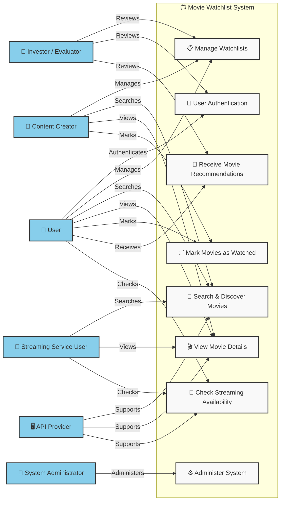

<h1>Use Case Diagram</h1>

```mermaid

graph LR;
    %% Define actors
    User["🧑 User"]:::actor
    ContentCreator["🧑 Content Creator"]:::actor
    StreamingServiceUser["🧑 Streaming Service User"]:::actor
    SystemAdministrator["🧑 System Administrator"]:::actor
    APIProvider["🖥️ API Provider"]:::actor
    InvestorProjectEvaluator["💼 Investor / Evaluator"]:::actor

    %% Define system boundary
    subgraph MovieWatchlistSystem["📺 Movie Watchlist System"]
        UserAuthentication["🔑 User Authentication"]:::usecase
        ManageWatchlists["📋 Manage Watchlists"]:::usecase
        SearchDiscoverMovies["🔎 Search & Discover Movies"]:::usecase
        ViewMovieDetails["🎬 View Movie Details"]:::usecase
        MarkMoviesWatched["✅ Mark Movies as Watched"]:::usecase
        ReceiveMovieRecommendations["🤖 Receive Movie Recommendations"]:::usecase
        CheckStreamingAvailability["📡 Check Streaming Availability"]:::usecase
        AdministerSystem["⚙️ Administer System"]:::usecase
    end

    %% Define relationships
    User -->|Authenticates| UserAuthentication
    User -->|Manages| ManageWatchlists
    User -->|Searches| SearchDiscoverMovies
    User -->|Views| ViewMovieDetails
    User -->|Marks| MarkMoviesWatched
    User -->|Receives| ReceiveMovieRecommendations
    User -->|Checks| CheckStreamingAvailability

    ContentCreator -->|Manages| ManageWatchlists
    ContentCreator -->|Searches| SearchDiscoverMovies
    ContentCreator -->|Views| ViewMovieDetails
    ContentCreator -->|Marks| MarkMoviesWatched

    StreamingServiceUser -->|Searches| SearchDiscoverMovies
    StreamingServiceUser -->|Views| ViewMovieDetails
    StreamingServiceUser -->|Checks| CheckStreamingAvailability

    SystemAdministrator -->|Administers| AdministerSystem

    APIProvider -->|Supports| SearchDiscoverMovies
    APIProvider -->|Supports| ViewMovieDetails
    APIProvider -->|Supports| CheckStreamingAvailability

    InvestorProjectEvaluator -->|Reviews| ManageWatchlists
    InvestorProjectEvaluator -->|Reviews| UserAuthentication
    InvestorProjectEvaluator -->|Reviews| ReceiveMovieRecommendations

    %% Styling
    classDef actor fill:#87CEEB,stroke:#333,stroke-width:2px;
    classDef usecase fill:#F9F9F9,stroke:#333,stroke-width:2px;
    
    class User,ContentCreator,StreamingServiceUser,SystemAdministrator,APIProvider,InvestorProjectEvaluator actor;
    class UserAuthentication,ManageWatchlists,SearchDiscoverMovies,ViewMovieDetails,MarkMoviesWatched,ReceiveMovieRecommendations,CheckStreamingAvailability,AdministerSystem usecase;

```

